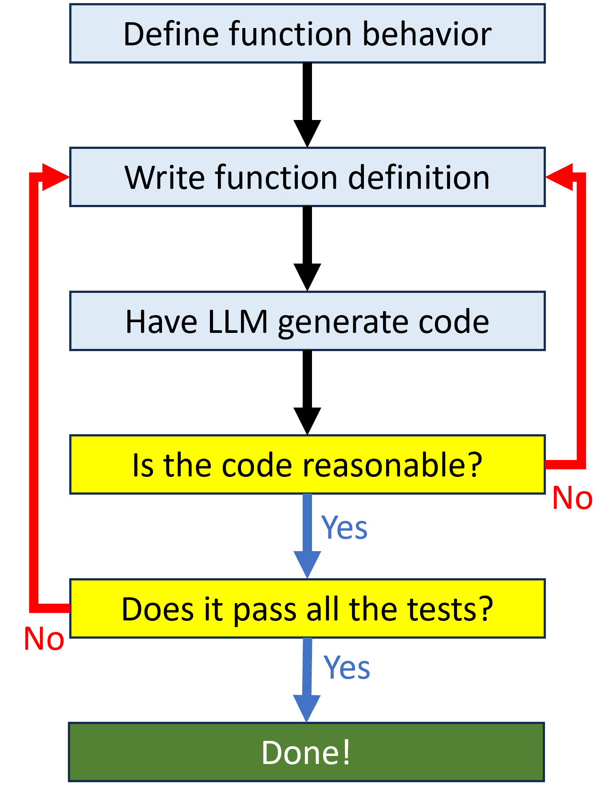

One way to work effectively with an AI code assistant is to write code that defines and uses functions. As you will see later, that makes it easier to break a large problem into more manageable pieces. Generally, you the human will design the function, and the model will use that design as a prompt to generate code. There are some guidelines you should follow when designing functions so that the model is more likely to generate usable code.

## Clearly define the task
A single function should perform a single job. You should be able to come up with a relatively short function name that clearly summarizes what that job is. If you find yourself creating functions with names like do_x_and_y, that is a signal your function is doing too many things. The function name is part of what the LLM will use to help it understand what kind of code to generate, so you want it to be as specific as possible. 

## Limit input parameters
In the function definition, the input parameters are the names you put inside the parentheses. These names represent values that are used in the function. Generally, a small number of parameters (four or less) will help the model generate better code. Giving these parameters good names that describe what the values represent will also help. The function name and parameters are together called the function signature.

## Add a doc string
A doc string provides additional specific details about what the function does and how it should work. This doc string is also part of the prompt the LLM will use. The doc string may define what the input parameters represent, what the expected output is, details about what the function should (or should not) do, or any other information that describes the function more fully than can be done by the name alone. Taken together, the function definition and doc string will look something like:

``` py linenums="1"
def clear_func_name(param1, param2):
    """
    doc string that clearly explains what the function does
    """
```

## Evaluate model output
Based on your function design, you can have the model generate the code that does what the function is supposed to do. You will need to check the model’s work, because chances are good that the generated code will not be correct. Some things to look out for:

* Function length. If the body of the function is more than about 20 lines of code, that is good evidence the model is trying to do too much. It also increases the possibility that there’s a mistake somewheres
* Output value. Check the value returned by the function. Is that what the function should produce?
* Code you don’t understand. This code may or may not be correct. If you don’t understand it, you can’t evaluate it. You can use the model itself to explain the code or run it by a trusted person.

If the generated output seems problematic, adjust your function name, parameters, and doc string to help the model produce a better response. We’ll talk more in the next section about prompt engineering so you can do this more effectively.

If the generated output seems reasonable, try a few test cases to see if you get the result you expect. If it works correctly, you’ve got a successful result! If not, you can go back and adjust your function design to get a working result from the model.

## Basic function design cycle

The function design cycle is the iterative process you will go through to create code using an AI code assistant. You will need to review the code generated by the model, both for general reasonableness and to ensure the code actually generates the desired result.

<figure markdown="span">
  { width="300" }
  <figcaption>Adapted from Porter & Zingaro, 2023</figcaption>
</figure>

## Exercise: Design a function
0.	In an editor of your choice, write a function signature and doc string
0.	If you have access to an LLM:
    0. Prompt the model to generate the function body
    0. Test the generated code to see the results
    0. Change the function design and re-prompt if needed
0.	If you do not have access to an LLM:
    0. Write additional function signatures and doc strings