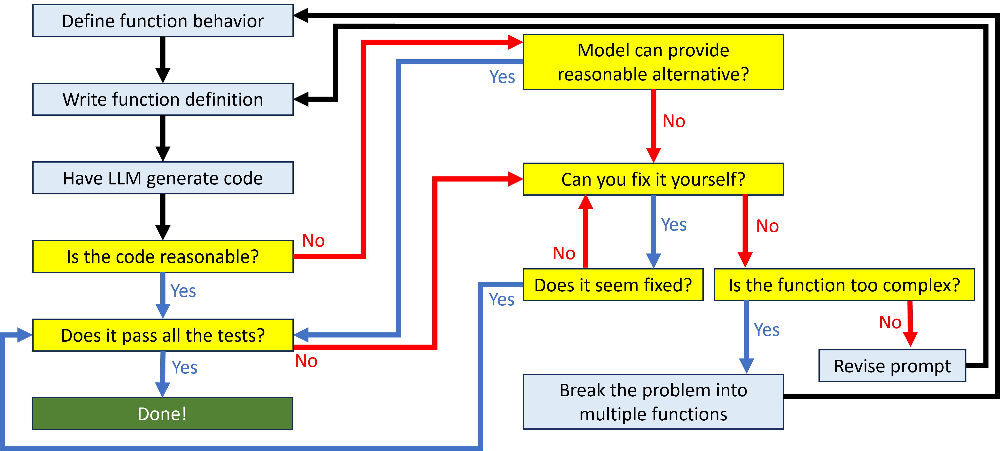

If you give an LLM a big problem and ask for a solution, chances are that it will fail to provide a reasonable response. As you have seen, they perform much better on narrower, more specific tasks. That’s especially true for GIS workflows. Because geospatial problems are a relatively niche topic, LLMs don’t have a robust training set from which they can generate coherent responses to questions about them. The models tend to do things like recommend raster data management tools for vector data. 

But sometimes we have a big problem, and we need a sophisticated solution. Fortunately, you can leverage your GIS expertise to help you break down a complex task into pieces small enough for the model to handle. 

## Top-down design
Imagine you had to identify areas for habitat conservation and started with a single big function definition like this:

``` py linenums="1"
def habitat_conservation(datasets):
    """
    Given the appropriate datasets, extract habitat locations for conservation
    """
```

The model will probably not be able to create appropriate code for this function. You need to decompose this problem into its constituent elements so that the model can reasonably provide an answer. This process of taking a big problem and breaking it down into pieces is called top-down design. For example, maybe you decide that the highest priority for conservation are habitats of threatened and endangered species that are within 2,000 meters of highways and not already inside existing conservation easements.

You might design a few different functions to fulfill these subtasks:

``` py linenums="1"
def get_highways(roads):
    """
    Given a feature class of roads, extract highway features
    """

def buffer_highways(highways):
    """
    Given a set of highway features, create a 2000 meter buffer around them
    """

def priority_habitats(habitats):
    """
    Given a feature class of habitats, 
    extract habitats for threatened or endangered species
    """
```

The model is much more likely to be able to provide solutions for these three narrower functions. And once you have working code for these sub-tasks, you can define a better function that puts all the pieces together. For example:

``` py linenums="1"
def habitat_conservation(roads, habitats, easements):
    """
    Given feature classes for roads, habitats, and conservation easements,
    identify habitats for threatened or endangered species 
    that are within 2000 meters of a highway
    and not within an existing easement
    """
```

Because the model now knows how to identify highways, buffer those highways, and extract the priority habitats, it can use those functions inside the larger habitat_conservation function that solves the entire task.

## Full function design cycle

Problem decomposition means that if the model isn’t providing you with usable code, you can improve your results by breaking a complex function down into its constituent parts. You can repeat this process, decomposing the problem into successively smaller pieces until you get a result that works.

<figure markdown="span">
  
  <figcaption>Adapted from Porter & Zingaro, 2023</figcaption>
</figure>

## Exercise: Decompose a problem

Given this too-big function:

``` py linenums="1"
def update_feature_class(csv):
    """
    Given a CSV file of addresses and other attributes, 
    update the appropriate existing point feature class
    adding new features as needed.
    """
```

Design a few other functions to perform the necessary subtasks