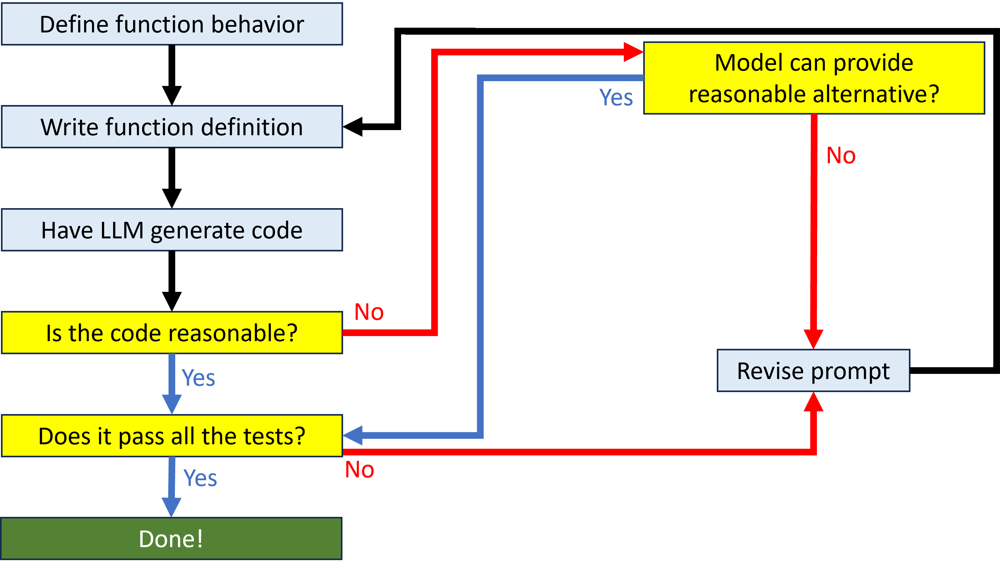
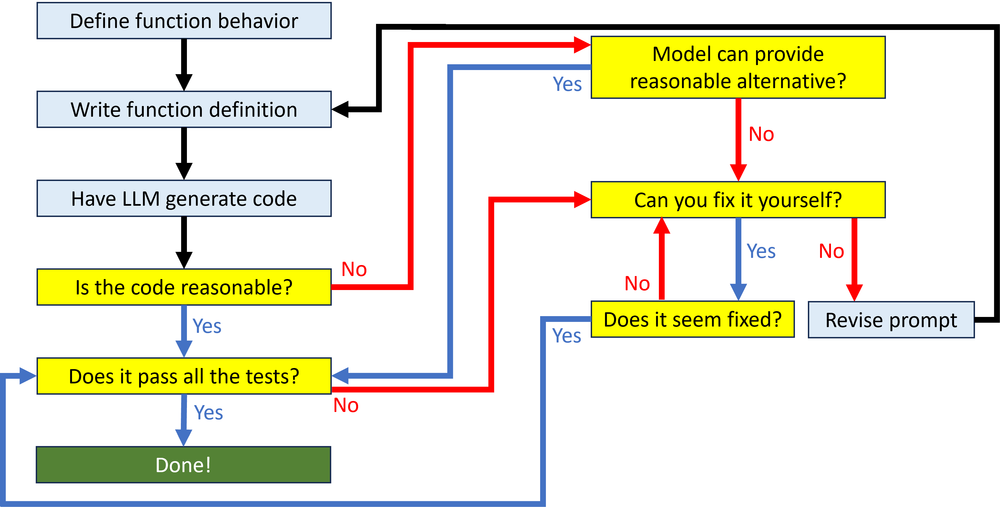

Prompt engineering is the official name for “messing around with the function design until the model gives us a result we like”. Effective prompt engineering is a key skill for working with LLMs, just like using effective search terms is a key skill for working with search engines. You will want to get a feel for what types of function designs are more likely to give you the results you want. And when you get results you don’t like, you want to be able to understand what kinds of changes are likely to work. Developing these intuitions takes practice, and involves as much art as science, but there are some specific prompt engineering strategies you can employ to increase the chances of success.

## Have the model suggest changes
Most models maintain sufficient context that they know what responses they have already provided. That means it is generally possible to interact with the model and have it provide fixes based on problems you have identified. 

For example, the Copilot extension for VS Code can provide alternatives to a selected code snippet with the ctrl+enter shortcut. If the Copilot Chat extension is installed, you can use the fix command to have Copilot suggest improvements to a snippet of code. These suggestions and fixes do not have to be on code generated by the model. You can have it suggest fixes for code you wrote yourself as well.

## Iterate on the prompt
If the model is not able to provide any helpful alternatives, it may be that the function design doesn’t have the right type of information to effectively prompt the model. There are a couple of iteration strategies that can be helpful:

* Add specificity. This might mean making the function name less generic, or it might mean adding details to the doc string. For example, the function name `geojson_extent` is more specific than `parse_geojson`.
* Add constraints. Sometimes, the model will suggest code that incorporates an inappropriate element. For example, it may create a new feature class when the function should modify a feature class in place. You might get better results by specifying in the doc string that the function should not create a new feature class.
* Narrow scope. The generated code may be bad because you’re asking the function to do too much. For example, a function to get the extent of geojson features may not successfully handle a file with multiple geometry types. Narrowing the scope to just a single geometry type may produce better results. For example, you might define a function `point_geojson_extent` instead of `geojson_extent`.

## Add tests
Another strategy for providing better prompting is to add automatic testing. The Python standard library has a module called doctest that lets you write tests in the doc string. When the code is executed, those tests are run as well, and doctest will tell you whether the code produced the expected results. Because the tests are in the doc string, they also help the model write code that is more likely to pass the tests.

When writing doctest tests, create several different tests to check different types of inputs. Just because the function correctly handles one situation does not mean it correctly handles every situation. In particular, think about potential cases where an input might be a problem. For example, does the function correctly handle inputs on the edge of the dataset? Or with very large or very small values? If a function is expecting polygon data, what should happen if the input is point geometry? Sometimes a function should raise an exception, and you can even write a test that ensures the correct error message is raised for a given bad input.

Tests written for doctest look like code that calls the function and shows the expected output of that function. For example:

``` py linenums="1"
def county_neighbors(county):
    """
        Given the name of a Minnesota county, return a sorted list 
        of other Minnesota counties that touch it.
        
        >>> county_neighbors('Ramsey')
        ['Anoka', 'Dakota', 'Hennepin', 'Washington']
        
        >>> county_neighbors('Chisago')
        ['Anoka', 'Isanti', 'Kanabec', 'Pine', 'Washington']
        
        >>> county_neighbors('St. Croix')
        Traceback (most recent call last):
        KeyError: 'St. Croix'

    """
```

In this case, the tests check three different situations, including a two potentially problematic ones. Chisago country, for example borders Wisconsin, but should not return any counties outside Minnesota. The return value should also include Kanabec County, even though it only borders Chisago County at a single point. St. Croix is not the name of any county in Minnesota, and the function should return a `KeyError` if that name is passed as an input. 

When you call the `doctest.testmod()` function in your code, doctest runs all the tests you defined and compares the actual values returned to the expected values. If they match, the test passes. The doctest module will report how many tests passed, and the actual values returned for any failing tests. For example, a function that did not correctly check counties that border at a single point would return the following output showing that one of the three tests had failed.

```
doctest.testmod()
**********************************************************************
File "__main__", line 7, in __main__.county_neighbors
Failed example:
    county_neighbors('Chisago')
Expected:
    ['Anoka', 'Isanti', 'Kanabec', 'Pine', 'Washington']
Got:
    ['Anoka', 'Isanti', 'Pine', 'Washington']
**********************************************************************
1 items had failures:
   1 of   3 in __main__.county_neighbors
***Test Failed*** 1 failures.
TestResults(failed=1, attempted=3)
```

## Add prompt engineering to the function design cycle
Prompt engineering lets you add some specificity to the function design cycle to handle those situations where you don’t get the response you want:

<figure markdown="span">
  
  <figcaption>Adapted from Porter & Zingaro, 2023</figcaption>
</figure>

## Exercise: Improve a function

Given this terrible function design:

``` py linenums="1"
def md(first, second):
    """
    Calculate Manhattan distance.
    """
```

0. Improve:
    0. Function name
    0. Parameter names
    0. Doc string description
0. Add tests to the doc string

## The role of human code-generating skill
If you’re already a Python expert, you may wonder what benefit AI code generation has for you. After all, you can already write better code than it can. But using an AI to help generate code means you can write code faster.  Boilerplate code, boring conditional blocks, long dictionary definitions, and other tedious constructs can all be created much faster when the AI writes them for you. That frees you up to focus on higher-level thinking about the code. AI code generation doesn’t mean your expertise is wasted. It just means you engage with the language differently.

## Add manual review to the function design cycle
The more you know about Python, the more you can short circuit some of the function design process. If you can fix some of the problems in the generated code yourself, you don’t have to re-write the prompt and try to get the model to fix it.

<figure markdown="span">
  
  <figcaption>Adapted from Porter & Zingaro, 2023</figcaption>
</figure>